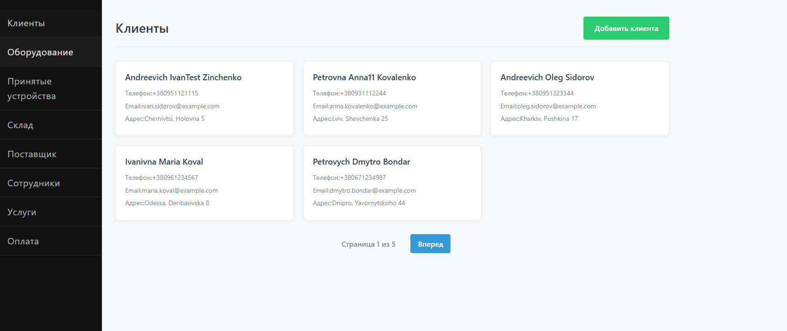
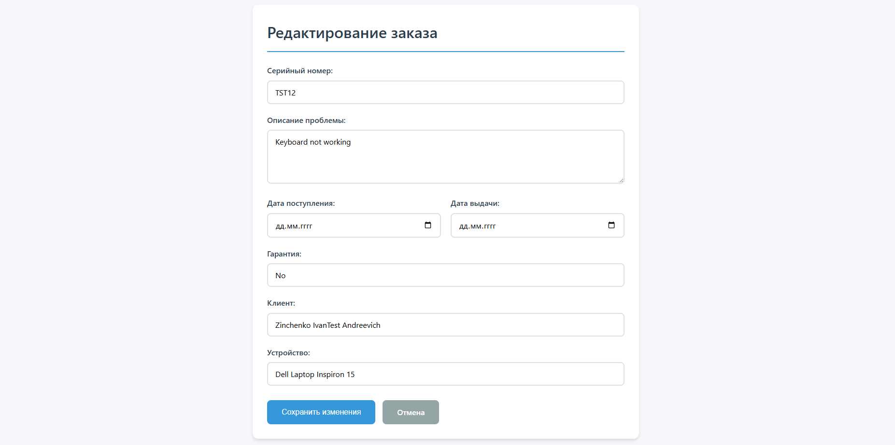
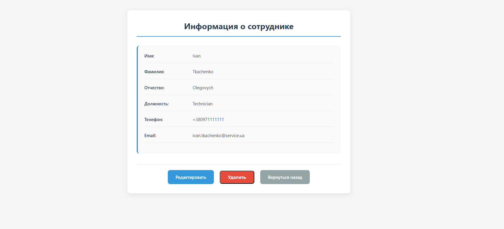

# Service Repair — система управления ремонтом и платежами

## Описание проекта

Проект реализует базовую CRUD‑логику для:

* клиентов
* оборудование
* принятых устройств
* склад
* поставщик
* сотрудники
* услуги
* оплата

---

## Используемые технологии

* **Java**
* **Spring Framework (Spring MVC)**
* **Spring JDBC (JdbcTemplate)**
* **Thymeleaf**
* **HTML / CSS**
* **PostgreSQL**
* **Gradle**

---

## Архитектура проекта

Проект построен по классической MVC‑архитектуре:

```
Controller → DAO → Database
     ↓
  Thymeleaf
```

---

## Основные сущности

### Client

Хранит информацию о клиентах сервисного центра.

### Device

Описывает устройство, принадлежащее клиенту.

### Order

Заказ на ремонт устройства.

Содержит:

* ссылку на устройство
* описание неисправности
* статус ремонта

### Payment

Платёж за выполненный заказ.

Содержит:

* сумму
* дату платежа
* метод оплаты
* **order_id — ссылку на заказ**

---

## Ключевые архитектурные решения

* Каждая сущность редактируется **только своим контроллером**
* `Payment` хранит только `order_id`, без дублирования данных заказа
* Редактирование заказа и платежа разделено
* DAO‑слой изолирует SQL от контроллеров

---

## Реализованный функционал

### Заказы (Orders)

* просмотр списка заказов
* просмотр одного заказа
* добавление
* редактирование
* удаление

### Платежи (Payments)

* пагинация списка платежей
* добавление платежа
* редактирование платежа
* привязка платежа к заказу
* удаление платежа

---

## Пример маршрутов

```
GET     /payments              — список платежей
GET     /payments/{id}         — просмотр платежа
GET     /payments/{id}/edit    — редактирование платежа
POST    /payments/{id}/update  — обновление
POST    /payments/{id}/delete  — удаление
```

---

## Интерфейс

* Используется **Thymeleaf**
* Общий CSS‑файл
* Адаптивная вёрстка
* Отдельные страницы для:

    * списка
    * просмотра
    * редактирования

---

## Пример


